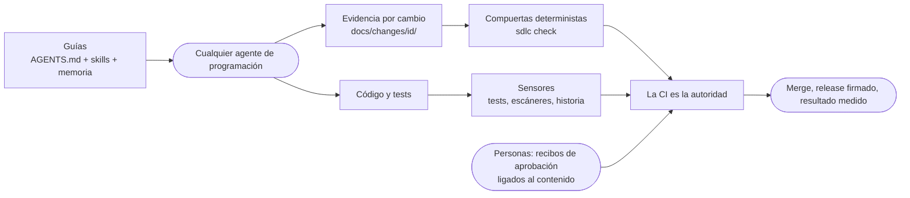

# sdlc-harness

> [Read in English](README.md)

Un **arnés agnóstico al agente para el ciclo de vida del desarrollo de software**. Da a cualquier agente de
programación (Claude Code, Codex, GitHub Copilot, Cursor, Gemini CLI, Windsurf, OpenCode...) las mismas guías y
las mismas compuertas deterministas, desde la especificación hasta la operación. Sus controles escalan desde un
desarrollador individual hasta una organización regulada. No depende del stack ni de la nube: funciona en nube
pública, nube privada, on-prem o entornos air-gapped.

**Estado:** v0.7.2, versión preliminar.

## Por qué

Un agente de programación es tan confiable como el arnés que lo rodea: las **guías** que lee antes de actuar y los
**sensores** que le indican, de forma determinista, cuándo se equivocó. Este proyecto empaqueta ese arnés sobre
estándares abiertos para que un equipo pueda cambiar o combinar agentes sin rehacer su proceso.

## Qué incluye

- **`AGENTS.md` + 18 Agent Skills** que cubren todo el ciclo: descubrimiento, especificación, diseño (ADR, modelo de
  amenazas, UX, datos y privacidad, FinOps, riesgo de IA), planificación, implementación, verificación, revisión,
  release, operación, resultados, retiro, revisión de iteración y mantenimiento.
- **Change records** (`docs/changes/<id>/`) con plantillas: la evidencia vive junto al código y sobrevive a los
  reinicios de contexto.
- **Compuertas de fase** que verifican consistencia (criterios trazados a tests, amenazas a controles), ejecutadas por
  una CLI sin dependencias incluida en cada repositorio, idéntica en git hooks y en CI (GitHub Actions y GitLab).
- **Aprobaciones humanas ligadas al contenido**: recibos SHA-256 por artefacto, roles y matriz de autoridad, generación
  de CODEOWNERS, separación de funciones, verificación contra la plataforma en CI y log de auditoría encadenado por hash.
  Quien mantiene el repositorio en soledad, y no puede aprobar su propio pull request, prueba la aprobación con una
  firma de commit verificada. `sdlc amend` le muestra a quien aprueba qué cambió desde su aprobación, para que nadie
  tenga que elegir entre un recibo válido y un documento verdadero.
- **Sensores deterministas**: orden test-first y detección de tests debilitados a partir de la historia de git, reglas
  de capas ejecutables con referencia a ADRs, detección de cambios incompatibles en OpenAPI/AsyncAPI y una política
  única sobre cualquier escáner SARIF y SBOM CycloneDX (umbral de severidad, licencias prohibidas, excepciones con
  vencimiento).
- **Política de organización y memoria**: política obligatoria vendorizada con desviaciones que vencen, memoria
  revisada en PR y un servidor MCP con herramientas de solo lectura (salvo `memory_add`) para cualquier agente.
- **Visibilidad**: reportes de trazabilidad, flujo de entrega y métricas estilo DORA en Markdown, JSON o HTML;
  `sdlc status` dice qué falta y quién debe aprobar, y `sdlc explain` documenta cualquier fase, artefacto, rol o mensaje.
- **Distribución y actualizaciones**: pipx o un único archivo sin red, marketplace de plugins de Claude Code,
  extensión de Gemini CLI, `npx skills add`; adopción en repos existentes con detección del stack; `sdlc upgrade` de 3
  vías que conserva las personalizaciones.
- **Evals de comportamiento** que miden si cada agente realmente sigue el arnés.
- **Releases firmados**: SBOM, attestations de procedencia SLSA y de SBOM, firmas keyless con Sigstore (GitHub y GitLab).
- **Perfiles** `lite`, `standard` y `regulated` que exigen artefactos según el tipo y el riesgo del cambio.
- **Adaptadores** generados para los agentes que no leen `.agents/skills` de forma nativa.
- **Matriz de controles** mapeada a NIST SSDF, SLSA, OWASP Agentic Top 10, DORA y marcos de gobierno de IA.


## Cómo funciona



Fases: `discover → spec → design → plan → implement → verify → review → release → operate`. Cada una produce evidencia,
y la siguiente no empieza hasta que la compuerta pasa y la persona correspondiente aprobó.

## Inicio rápido

```bash
pipx install git+https://github.com/huanrasan/sdlc-harness@v0.7.2
sdlc init ../mi-servicio --interactive           # instalación guiada; agregá --adopt en un repo existente
cd ../mi-servicio
python3 .harness/sdlc.pyz hooks && python3 .harness/sdlc.pyz doctor
python3 .harness/sdlc.pyz new feature payment-retries --risk medium
```

Luego pídele a tu agente que trabaje en el cambio: `AGENTS.md` lo dirige a la skill `sdlc-orchestrator`.

## Documentación

| | Español | English |
|---|---|---|
| Sitio de documentación | [huanrasan.github.io/sdlc-harness](https://huanrasan.github.io/sdlc-harness/) | ídem |
| Ejemplo completo de un cambio | [docs/examples/](docs/examples/README.md) | ídem |
| Glosario | [docs/es/glosario.md](docs/es/glosario.md) | [docs/en/glossary.md](docs/en/glossary.md) |
| Guía paso a paso | [docs/es/recorrido.md](docs/es/recorrido.md) | [docs/en/walkthrough.md](docs/en/walkthrough.md) |
| Guía de uso (referencia) | [docs/es/guia.md](docs/es/guia.md) | [docs/en/guide.md](docs/en/guide.md) |
| Notas de actualización | [docs/es/actualizar.md](docs/es/actualizar.md) | [docs/en/upgrading.md](docs/en/upgrading.md) |
| Investigación y fundamentos del diseño | [docs/es/investigacion.md](docs/es/investigacion.md) | [docs/en/research.md](docs/en/research.md) |
| Matriz de controles | [docs/es/controles.md](docs/es/controles.md) | [docs/en/controls.md](docs/en/controls.md) |
| Decisiones (ADRs) | | [docs/adr/](docs/adr/README.md) |

Política de idioma: las guías son bilingües. Los archivos dirigidos a agentes (skills, plantillas, `AGENTS.md`) y
los ADRs están en inglés como fuente única.

## Principios

1. Estándares abiertos antes que funciones propietarias. 2. Compuertas deterministas antes que instrucciones.
3. El agente nunca aprueba su propio trabajo. 4. Ceremonia proporcional al riesgo. 5. Evidencia dentro del
repositorio. 6. Todo error repetido se convierte en un control.

## Contribuciones, seguridad y licencia

Ver [CONTRIBUTING.md](CONTRIBUTING.md) y [SECURITY.md](SECURITY.md). Licencia [MIT](LICENSE).
Fuentes y créditos: [ACKNOWLEDGEMENTS.md](ACKNOWLEDGEMENTS.md).
