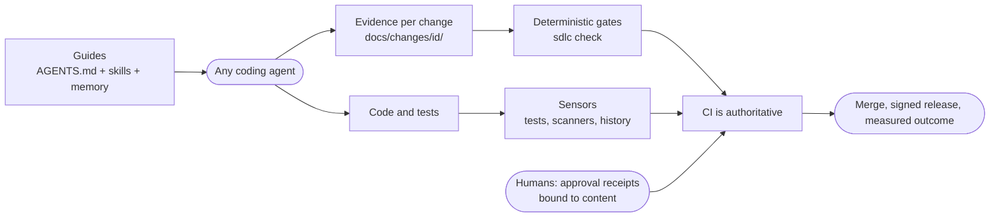

# sdlc-harness

> [Leer en español](README.es.md)

An **agent-agnostic harness for the software development lifecycle**. It gives any coding agent (Claude Code,
Codex, GitHub Copilot, Cursor, Gemini CLI, Windsurf, OpenCode...) the same guides and the same deterministic
gates, from specification to operation, with controls that scale from a solo developer to a regulated organization.
Stack- and cloud-agnostic: public cloud, private cloud, on-prem or air-gapped.

**Status:** v0.7.1, early preview.

## Why

Coding agents are only as reliable as the harness around them: the **guides** they read before acting and the
**sensors** that tell them, deterministically, when they got it wrong. This project packages that harness on open
standards so a team can switch or mix agents without rebuilding its process.

## What you get

- **`AGENTS.md` + 18 Agent Skills** covering the whole lifecycle: discovery, specification, design (ADR, threat model,
  UX, data and privacy, FinOps, AI risk), plan, implement, verify, review, release, operate, outcome, retirement,
  iteration review and maintenance.
- **Change records** (`docs/changes/<id>/`) with templates: evidence lives next to the code and survives context resets.
- **Phase gates** that check consistency (criteria traced to tests, threats to controls), run by a zero-dependency
  CLI vendored into each repository, identical in git hooks and CI (GitHub Actions and GitLab).
- **Human approvals bound to content**: SHA-256 receipts per artifact, roles and authority matrix, CODEOWNERS
  generation, separation of duties, platform-verified in CI, and a hash-chained audit log. A single maintainer, who
  cannot approve their own pull request, proves the approval with a verified commit signature instead. `sdlc amend`
  shows the approver what changed since their approval, so nobody has to choose between a valid receipt and a
  truthful document.
- **Deterministic sensors**: test-first ordering and weakened-test detection from git history, executable layer
  rules citing ADRs, OpenAPI/AsyncAPI breaking-change detection, and a single policy over any SARIF scanner and
  CycloneDX SBOM (severity threshold, license deny list, expiring exceptions).
- **Organization policy and memory**: vendored mandatory policy with expiring deviations, reviewed memory entries,
  and an MCP server with read-mostly tools for any agent.
- **Visibility**: traceability, delivery flow and DORA-style reports as Markdown, JSON or HTML; `sdlc status` says
  what is missing and who must approve, `sdlc explain` documents any phase, artifact, role or gate message.
- **Distribution and upgrades**: pipx or a single offline file, Claude Code plugin marketplace, Gemini CLI
  extension, `npx skills add`; brownfield adoption with stack detection; 3-way `sdlc upgrade` that keeps customizations.
- **Behavioural evals** that measure whether each agent actually follows the harness.
- **Signed releases**: SBOM, SLSA provenance and SBOM attestations, keyless Sigstore signatures (GitHub and GitLab).
- **Profiles** `lite`, `standard` and `regulated` that require artifacts by change type and risk.
- **Adapters** generated for agents that do not read `.agents/skills` natively.
- **Controls matrix** mapped to NIST SSDF, SLSA, OWASP Agentic Top 10, DORA and AI governance frameworks.



## How it works



Phases: `discover → spec → design → plan → implement → verify → review → release → operate`. Each one produces
evidence, and the next phase does not start until the gate passes and the required human has approved.

## Quick start

```bash
pipx install git+https://github.com/huanrasan/sdlc-harness@v0.7.1
sdlc init ../my-service --interactive           # guided setup; add --adopt for an existing repository
cd ../my-service
python3 .harness/sdlc.pyz hooks && python3 .harness/sdlc.pyz doctor
python3 .harness/sdlc.pyz new feature payment-retries --risk medium
```

Then ask your agent to work on the change; `AGENTS.md` routes it to the `sdlc-orchestrator` skill.

## Documentation

| | English | Español |
|---|---|---|
| Documentation site | [huanrasan.github.io/sdlc-harness](https://huanrasan.github.io/sdlc-harness/) | idem |
| Complete example change | [docs/examples/](docs/examples/README.md) | idem |
| Glossary | [docs/en/glossary.md](docs/en/glossary.md) | [docs/es/glosario.md](docs/es/glosario.md) |
| Step-by-step walkthrough | [docs/en/walkthrough.md](docs/en/walkthrough.md) | [docs/es/recorrido.md](docs/es/recorrido.md) |
| User guide (reference) | [docs/en/guide.md](docs/en/guide.md) | [docs/es/guia.md](docs/es/guia.md) |
| Research and design rationale | [docs/en/research.md](docs/en/research.md) | [docs/es/investigacion.md](docs/es/investigacion.md) |
| Controls matrix | [docs/en/controls.md](docs/en/controls.md) | [docs/es/controles.md](docs/es/controles.md) |
| Decisions (ADRs) | [docs/adr/](docs/adr/README.md) | |

Language policy: guides are bilingual; agent-facing files (skills, templates, `AGENTS.md`) and ADRs are in English
as the single source of truth.

## Principles

1. Open standards over vendor features. 2. Deterministic gates over instructions. 3. The agent never approves its own
work. 4. Ceremony proportional to risk. 5. Evidence in the repository. 6. Every repeated mistake becomes a control.

## Contributing, security, license

See [CONTRIBUTING.md](CONTRIBUTING.md) and [SECURITY.md](SECURITY.md). Licensed under [MIT](LICENSE).
Sources and credits: [ACKNOWLEDGEMENTS.md](ACKNOWLEDGEMENTS.md).
