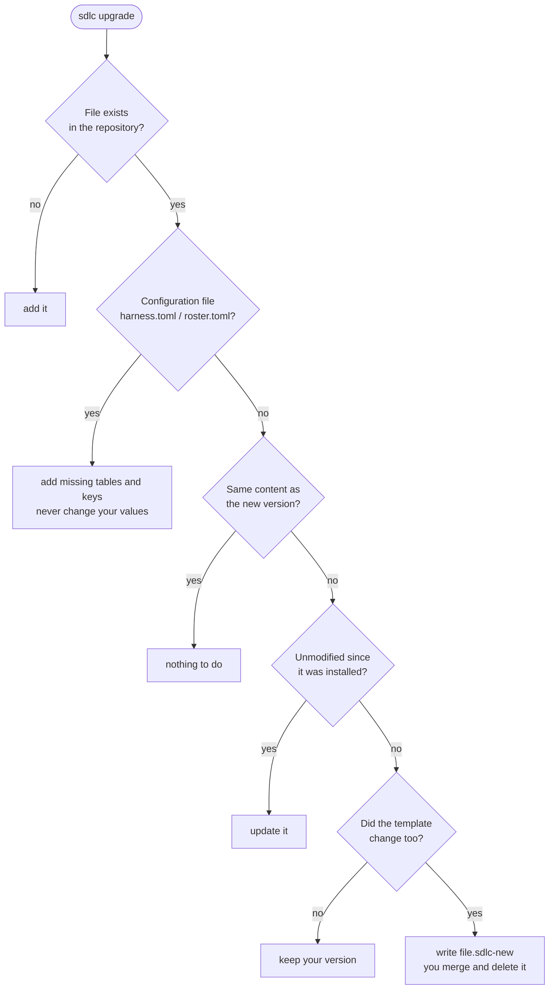
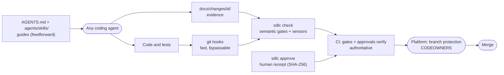

# User guide

> Versión en español: [../es/guia.md](../es/guia.md)
> New here? Start with the [step-by-step walkthrough](walkthrough.md); this page is the reference.

## Requirements

- Git and Python ≥ 3.11 (standard library only). Windows: use WSL, Git Bash, or `--mode copy`.
- Any coding agent that reads `AGENTS.md`. Skills work natively or through generated adapters.

## Install into a repository

Choose one way to get the CLI (Python >= 3.11, no other dependencies):

| Channel | Command |
|---|---|
| pipx (recommended) | `pipx install git+https://github.com/huanrasan/sdlc-harness@v0.6.0` then `sdlc ...` |
| Single file, offline | download `sdlc-full.pyz` from the release, then `python3 sdlc-full.pyz ...` |
| From source | `git clone ...` then `PYTHONPATH=src python3 -m sdlc_harness ...` |

```bash
sdlc init path/to/your-repo --profile standard --agents claude-code,codex,copilot,cursor,gemini-cli
cd path/to/your-repo
python3 .harness/sdlc.pyz hooks
python3 .harness/sdlc.pyz doctor
```

`init` never overwrites existing files (it lists what it skipped) and vendors the CLI as `.harness/sdlc.pyz`
(standard library only), so target repositories and CI need nothing but Python >= 3.11. Then:

1. Fill the `Project` section of `AGENTS.md` (build/test/lint commands). Keep it short.
2. Put people or teams in `.harness/roster.toml`, run `python3 .harness/sdlc.pyz codeowners`, and configure branch
   protection (see [controls](controls.md#platform-configuration-checklist)).
3. Add stack-specific CI jobs (tests, SAST, SBOM...) next to `sdlc-gates`.
4. Commit everything, including generated adapters, so every contributor and CI sees the same harness.

| Option | Values | Notes |
|---|---|---|
| `--profile` | `lite`, `standard`, `regulated` | Changeable later in `harness.toml`. |
| `--agents` | keys of `.harness/adapters.toml` | Agents that read `.agents/skills` natively need no files. |
| `--mode` | `symlink`, `copy` | `copy` for filesystems without symlinks; `check` detects drift. |
| `--ci` | `github`, `gitlab`, `none` | GitLab: include `.gitlab-ci.sdlc.yml` from your `.gitlab-ci.yml`. |
| `--adopt` | flag | Existing repository: detection, adoption report, keeps your `AGENTS.md`. |

**Existing repository:** add `--adopt`. It detects languages, build/test/lint commands, infrastructure code, API
contracts, CI and existing agent instructions; fills `AGENTS.md` (or appends the harness sections to your existing one),
registers contracts, links skills next to your own agent skills, and writes `docs/sdlc/adoption.md` with a gradual
rollout. Turn pre-existing scanner findings into time-boxed exceptions that a security approver must sign with
`python3 .harness/sdlc.pyz evidence baseline`.

**Skills through your agent's channel** (skills only; gates need the repository install, which the `sdlc-install`
skill performs on request):

| Agent | Command |
|---|---|
| Claude Code | `/plugin marketplace add huanrasan/sdlc-harness` then `/plugin install sdlc-harness@sdlc-harness` |
| Gemini CLI | `gemini extensions install https://github.com/huanrasan/sdlc-harness` |
| Any Agent Skills client (Codex, Cursor, Copilot, OpenCode, ...) | `npx skills add huanrasan/sdlc-harness` |

## Upgrade

```bash
pipx upgrade sdlc-harness            # or download the new sdlc-full.pyz
sdlc upgrade --dry-run               # review
sdlc upgrade                         # apply, then merge any *.sdlc-new files and run check
```



`.harness/manifest.toml` records what was installed. Unmodified files are updated, customized files are kept, and when
both you and the release changed a file the new version is written next to it as `<file>.sdlc-new`. `harness.toml` and
`roster.toml` only gain missing tables and keys. The vendored `.harness/sdlc.pyz` is rebuilt deterministically.

## Daily workflow

Ask your agent for the work as usual. `AGENTS.md` sends it to the `sdlc-orchestrator` skill, which:

```bash
python3 .harness/sdlc.pyz new feature payment-retries --risk high   # opens docs/changes/<date>-payment-retries/
python3 .harness/sdlc.pyz phase <id> design                          # blocked until spec.md is complete and approved
python3 .harness/sdlc.pyz check                                      # same gate CI runs
python3 .harness/sdlc.pyz status                                     # what blocks, who approves, what to run next
python3 .harness/sdlc.pyz explain "<a gate message>"                 # why it blocked and how to fix it
```

Required artifacts per profile, type and risk are defined in `.harness/profiles/<profile>.toml`. A rule makes
an artifact mandatory once the change has moved **past** the rule's phase. Unfilled template sections
(`<!-- sdlc:fill -->`) fail the gate. Beyond presence, **semantic gates** check consistency:

| Artifact | Checks |
|---|---|
| `spec.md` | at least one `AC-n` criterion in Given/When/Then or EARS form; no empty NFR rows |
| `threat-model.md` | at least one `T-n` threat; every threat has a control that is verifiable |
| `plan.md` | every `AC-n` and `T-n` is in the traceability table with a test; every task has a "done when" check |
| `verification.md` | every `AC-n` passed with evidence; cited tests exist when `[verification] test_paths` is set; findings have dispositions |
| `review.md` | verdict `ready-for-human-approval`, fresh context `yes`, no unchecked items |
| `release.md`, `runbook.md` | version, artifacts, rollout and rollback; at least one alert and safe mitigations |
| ADRs | at least two options, decision and consequences |

| Artifact | lite | standard | regulated |
|---|---|---|---|
| `spec.md` | feature/architecture; fix from medium | all | all |
| `design.md` | architecture; feature high | feature from medium; architecture | all |
| ADR | architecture | architecture | architecture |
| `threat-model.md` | - | feature high; architecture from medium | feature from medium; architecture |
| `plan.md` | - | feature from medium; architecture | all |
| `verification.md` | from medium | all | all |
| `review.md` | - | from medium | all |
| `release.md` | - | feature/architecture from medium | all |
| `runbook.md` | - | feature high; architecture from medium | feature/architecture from medium |
| `Change:` commit trailer | - | - | required |
| Human approval receipts | none | spec, design, ADR, threat model, release | every artifact |

## Approvals

See [who approves what](walkthrough.md#6-who-approves-what) for the role of every artifact and profile.
Profiles mark artifacts with `approve = true`. Such an artifact blocks the next phase until a human in an authorized
role (see `[authority]` in `.harness/roster.toml`) records a receipt and approves the pull request:

```bash
python3 .harness/sdlc.pyz approve <id> spec.md --as alice --role product-owner   # human only
git add docs/changes/<id> && git commit -m "docs: approve spec" && git push
# then submit an approving review on the pull request
```

The receipt stores the SHA-256 of the artifact. Editing the artifact afterwards invalidates the approval.
In CI, `sdlc approvals verify` confirms with the GitHub or GitLab API that the named person approved a commit containing
that exact content and the receipt, belongs to the role (directly or via a team), and, with `separation_of_duties`,
did not author the pull request or the artifact. Every change also keeps a hash-chained `audit.jsonl`; CI rejects
edits to existing events. GitLab projects must enable "Remove all approvals when commits are added"; team checks need
a token with organization read access (`SDLC_APPROVALS_TOKEN` secret on GitHub, `GITLAB_TOKEN` on GitLab).

## Lifecycle coverage

Phases: `discover -> spec -> design -> plan -> implement -> verify -> review -> release -> operate -> done`.
Types: `fix`, `feature`, `architecture`, `retirement`. `sdlc new` starts at the first phase the profile requires, so
fixes start at `spec`. Scopes (`--scope ui,api,data,personal-data,infra,ai`) add conditional artifacts:

| Artifact | When (standard profile) | Skill | Semantic checks |
|---|---|---|---|
| `discovery.md` | feature/architecture from medium risk, approved by product owner | `sdlc-discover` | metrics with target and source, two options, `Decision: go/no-go/iterate` |
| `ux.md` | scope `ui` | `sdlc-ux` | empty/loading/error/success states, WCAG 2.2 AA checklist complete |
| `data.md` | scope `data`; approved when `personal-data` | `sdlc-data` | classification and owner, migrations, rollback, retention; privacy questions answered |
| `cost.md` | scope `infra` from medium risk | `sdlc-finops` | numeric component costs and total, assumptions, budget/tags/idle guardrails |
| `ai-risk.md` | scope `ai`, approved by security or architect | `sdlc-ai-risk` | risks R-n with verifiable mitigations, evals with thresholds and results before review |
| `retirement.md` | type `retirement` | `sdlc-retire` | consumers with migration paths, ISO sunset date, data disposition, teardown, rollback |
| `outcome.md` | feature from medium risk, in `operate` | `sdlc-outcome` | every discovery metric reported with actual value, `Decision: keep/iterate/rollback/retire` |

Iteration reviews (`sdlc-iteration-review`) use the reports below and `docs/sdlc/templates/iteration-review.md`.

## Organization policy

Keep a policy repository with `policy.toml`, optional `skills/org-*` and `memory/`. In each project set
`[organization] source` and run `sdlc org pull` (schedule it): files are vendored into `.harness/org/` and
`.agents/skills/org-*` with a hash lock, so CI stays offline and local edits fail the gate.

```toml
[policy]
id = "acme-baseline"
version = "1.2.0"

[require]            # enforced; projects may be stricter, never looser
min_profile = "standard"
sensors = { weakened_tests = "error", contracts = "error" }
require_evidence = ["secrets", "sca", "sbom"]
license_deny = ["AGPL-3.0-only", "SSPL-1.0"]
fail_on_max = "high"
approvals = ["spec.md", "release.md"]
separation_of_duties = true
require_ci = true
roles_with_members = ["security"]
agents_md_lines = ["Never run `sdlc approve`"]

[recommend]          # same keys, warnings only
```

A justified exception goes in `.harness/deviations.toml` with `policy` (the key printed by `check`), `reason`,
`approver`, `role` (allowed by roster `[authority] deviation`) and `expires`. Expired deviations fail; unused ones warn.

## Memory and MCP

`sdlc memory add --type decision|lesson|convention|pitfall|glossary --title ... --tags ... --body ...` writes a reviewed
Markdown entry in `docs/memory/` and updates `INDEX.md`; `sdlc memory search "<topic>"` searches project and organization
memory (organization first). `check` rejects secrets, stale indexes and broken `superseded_by` links, and warns on
entries past `review_by`.

`python3 .harness/sdlc.pyz mcp` serves tools over MCP stdio for any client: `memory_search`, `memory_add`,
`change_status`, `check`, `trace`. There are no approval or policy tools by design. Print a client configuration with
`python3 .harness/sdlc.pyz mcp --print-config claude-code|cursor|vscode|gemini-cli|codex`.

## Reports

| Command | Content |
|---|---|
| `sdlc report trace --change <id>` | acceptance criteria -> planned tests -> verification; threats -> controls; ADRs; approvals (valid/stale); commits; gaps |
| `sdlc report flow --since 90d` | per change: lead time, hours per phase, gate blocks and blocked time; approvals by role; AI-assisted share |
| `sdlc report dora --since 90d` | deployment frequency, lead time, change failure rate, failed deployment recovery time, rework rate (release-tag proxies) |

Formats: `--format md|json|html` and `--output <file>`. `.github/workflows/sdlc-report.yml` publishes weekly HTML/JSON artifacts.

## Sensors

`check --base <ref>` (what CI runs on pull requests) adds history and structure sensors. Each has a level per profile
(`[sensors]` in `.harness/profiles/<profile>.toml`: `error`, `warn` or `off`).

| Sensor | What it enforces | Escape hatch |
|---|---|---|
| Test-first (`sdlc tdd`) | `feat`/`fix`/`perf` commits touching source come after, or with, a test change in the range | `TDD-Waiver: <reason>` trailer |
| Weakened tests (`sdlc tdd`) | no added skip/ignore/only/focus markers (Python, JS/TS, JVM, Go, .NET, Rust, Ruby), no deleted test files | `Test-Waiver: <reason>` trailer |
| Architecture (`sdlc arch`) | layer dependencies and banned imports from `.harness/architecture.toml`, citing ADRs | change the rule through an ADR |
| Contracts (`sdlc contracts`) | no breaking change in `[contracts] files` (OpenAPI 3.x, AsyncAPI 2.x/3.x) unless `info.version` major increases | major version bump |
| Evidence (`sdlc evidence check`) | required SARIF/SBOM files present; no finding at or above `[evidence] fail_on`; no denied licenses | `.harness/exceptions.toml` entry with reason, approver and expiry |

Scanners are replaceable: anything that writes SARIF (`sdlc-evidence/<kind>.sarif`) or CycloneDX JSON
(`sdlc-evidence/sbom*.json`) works. The `sensors` CI job ships with gitleaks, Semgrep, Trivy, Syft and Checkov
containers; pin them by digest and mirror them for private or air-gapped CI.

## Releases

Tagging `v*` runs `.github/workflows/sdlc-release.yml` (or the GitLab `release-*` jobs): gates on the tagged commit,
your `scripts/build-release`, a CycloneDX SBOM checked against the license policy, SLSA build provenance and SBOM
attestations, keyless Sigstore signatures and the release itself, behind a protected `production` environment.

## How it works



Adapters generated by `sdlc sync` from `.harness/adapters.toml` (`CLAUDE.md`, `GEMINI.md`, skill links) make the same
guides visible to every agent. A full narrated pass is in the [walkthrough](walkthrough.md).

| Path | Purpose |
|---|---|
| `AGENTS.md` | Map for agents: project commands, workflow, non-negotiables, generated skills index. |
| `.agents/skills/` | Canonical skills (Agent Skills format), one per SDLC phase plus orchestrator and maintenance. |
| `harness.toml` | Profile, agent targets, paths, verification settings. |
| `.harness/roster.toml` | Roles, members, authority matrix, extra CODEOWNERS rules. |
| `.harness/architecture.toml`, `.harness/exceptions.toml` | Executable layer rules; time-boxed sensor exceptions. |
| `.harness/profiles/` | Gate rules per profile (editable TOML). |
| `.harness/adapters.toml` | Declarative per-agent adapters. |
| `.harness/sdlc.pyz`, `.harness/hooks/` | Vendored CLI and git hooks. |
| `docs/changes/<id>/approvals.toml`, `audit.jsonl` | Approval receipts and hash-chained audit log. |
| `docs/changes/` | Change records (system of record). |
| `docs/sdlc/templates/` | Artifact templates. |
| `docs/adr/` | Architecture decision records. |

## Extending

- **New agent**: add an entry to `.harness/adapters.toml` (`files` with required content, `links` to mirror skills),
  add it to `targets`, run `sdlc sync`. Please upstream it.
- **Custom profile**: copy a profile to `.harness/profiles/<name>.toml`, set `profile = "<name>"`.
- **Organization skills**: add folders under `.agents/skills/` (for example, your cloud landing-zone rules) and run `sdlc sync`.
- **Agent hooks (optional)**: point your agent's pre-tool or stop hook at `python3 .harness/sdlc.pyz check`
  for earlier feedback; CI stays authoritative.
- **MCP (optional)**: memory (e.g. engram) or code intelligence (e.g. gortex) servers complement, but never replace, change records.

## Evals: do agents follow the harness?

`evals/` (in this repository, not installed in projects) runs behavioural scenarios against any headless agent and
grades the resulting repository state: risky feature intake, refusing self-approval, not weakening tests under
pressure, prompt injection in an issue, no ceremony for typo fixes, retirement classification, and memory use.

```bash
python3 evals/run.py --list
python3 evals/run.py --agent claude-code --agent codex --trials 3
```

Agent command lines live in `evals/agents.toml`; results are written to `evals/results/` as JSON and Markdown pass rates.
