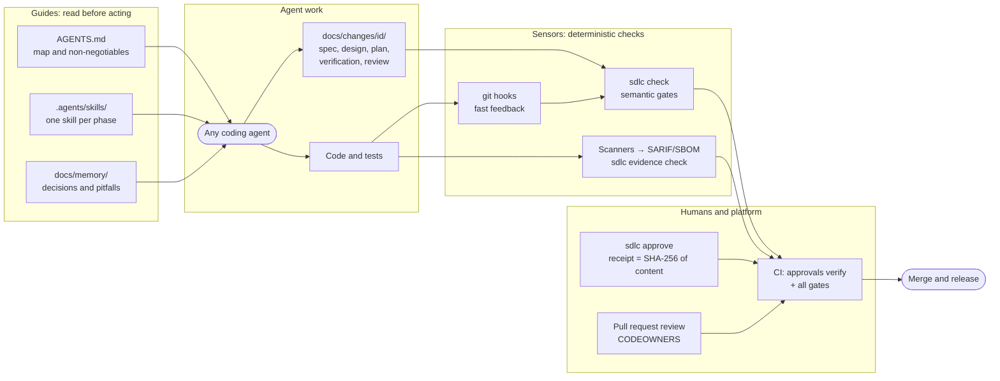
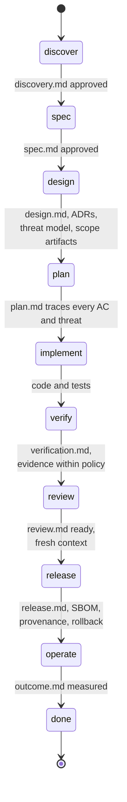
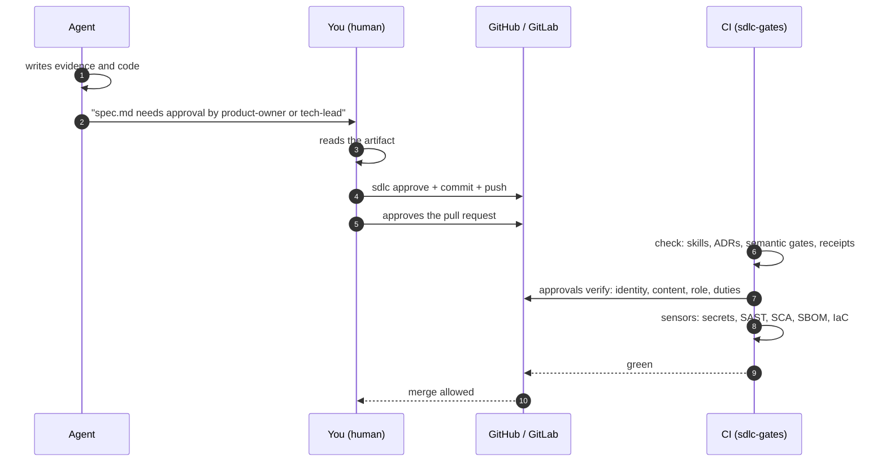
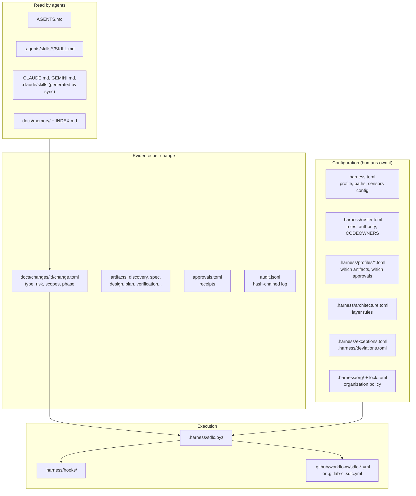

# Step-by-step walkthrough

> Versión en español: [../es/recorrido.md](../es/recorrido.md)
> Reference: [guide](guide.md) · [glossary](glossary.md) · [controls matrix](controls.md) · [decisions](../adr/README.md)
> A finished change record produced with the harness: [example](../examples/README.md)
> The same trip in full detail, phase by phase and role by role: [playbook](playbook.md)

This page follows one change from idea to production with the commands, who runs each one, and what happens when a
gate blocks. The running example is a booking web app for appointment-based businesses.

## 1. The idea in one picture

The harness surrounds the agent with **guides** (what it reads before acting) and **sensors** (deterministic checks
after it acts). Agents write evidence; the CLI checks it; humans approve; the platform proves the approval happened.



## 2. Before you start

| You need | Why |
|---|---|
| Git and Python >= 3.11 | The CLI is vendored into the repository as `.harness/sdlc.pyz` (standard library only) |
| A coding agent that reads `AGENTS.md` | Claude Code, Codex, Copilot, Cursor, Gemini CLI, Windsurf, OpenCode... |
| A GitHub or GitLab repository | Approvals are verified against the platform; branch protection makes gates blocking |
| People for the roles | The agent never approves; without members in the roster nobody can |

Decide the profile: `lite` (individuals, minimum evidence), `standard` (product teams, approvals from the start) or
`regulated` (audit duties, every artifact approved). You can change it later in `harness.toml`.

Two consequences worth knowing before you choose. In `standard` every change, including a low-risk `fix`, needs an
approved `spec.md`; if that would make each trivial fix wait on a signature, `lite` is the honest choice. And if you
are the only maintainer, set `separation_of_duties = false` in `.harness/roster.toml`: GitHub does not let you
approve your own pull request, so the harness then accepts a receipt that arrives in a commit whose signature the
platform verifies. Turn on commit signing before you start.

## 3. Install and configure (about ten minutes)

```bash
pipx install git+https://github.com/huanrasan/sdlc-harness@v0.6.0
sdlc init path/to/your-repo --profile standard --agents claude-code,codex,gemini-cli
cd path/to/your-repo
```

For an existing repository add `--adopt`: it detects your stack and commands, keeps your `AGENTS.md`, and writes
`docs/sdlc/adoption.md` with a gradual rollout.

Then, in order:

1. **Fill the `Project` section of `AGENTS.md`**: what the system does and the real build, test, lint and run commands.
   Agents run these; wrong commands are the most common cause of a bad first experience.
2. **Put people in `.harness/roster.toml`**, GitHub or GitLab usernames (or `@org/team`). Start with the roles the
   profile actually needs (see [section 6](#6-who-approves-what)); leave the rest empty and fill them when a scope appears.
   Working alone? Set `separation_of_duties = false`, otherwise you cannot approve your own pull request.
3. **Generate ownership and enable hooks**:
   ```bash
   python3 .harness/sdlc.pyz codeowners
   python3 .harness/sdlc.pyz hooks
   python3 .harness/sdlc.pyz doctor
   ```
4. **Make the gates blocking on the platform**: protect the default branch, require a pull request and the
   `sdlc-gates` checks, and require review from Code Owners. Without this, CI reports problems but nothing stops a merge.
5. **Commit everything**, including generated adapters (`CLAUDE.md`, `.claude/skills`, ...), so every contributor and CI
   see the same harness.

`doctor` should end in `OK`. Warnings about roles without members are expected until you fill the roster.

## 4. The first change, phase by phase

Ask your agent for the work in your own words:

> "I want a booking web app for appointment-based businesses: customers register, see availability, book and cancel
> appointments and receive email reminders; staff manage schedules from an admin panel."

`AGENTS.md` routes the agent to the `sdlc-orchestrator` skill, which classifies the work and opens a change record:

```bash
python3 .harness/sdlc.pyz new feature booking-mvp --risk high --scope ui,api,data,personal-data
```

From here every phase is: the agent produces evidence → the agent tries to advance → the gate passes or blocks.



### 4.1 Discover - is it worth building?

The agent writes `docs/changes/<id>/discovery.md`: problem with evidence, target users, value hypothesis, success
metrics with baseline and target, at least two options including "do nothing", and a `Decision: go`.

You read it and, if you agree, **you** record the approval and then approve the pull request:

```bash
python3 .harness/sdlc.pyz approve <id> discovery.md --as <your-username> --role product-owner
```

The receipt stores the SHA-256 of the file: if anyone edits `discovery.md` afterwards, the approval is void and the
gate blocks again. Agents must never run this command.

### 4.2 Spec - what does "done" mean?

`spec.md` needs acceptance criteria with ids (`AC-1`, `AC-2`, ...) written as Given/When/Then, plus non-functional
requirements with numbers. The gate rejects empty criteria and NFR rows. Approved by product owner or tech lead.

### 4.3 Design - decisions, risks and scope artifacts

The declared scopes decide which artifacts appear:

| Scope | Artifact | What the gate checks |
|---|---|---|
| always | `design.md` | solution overview, failure modes, rollout and rollback |
| architecture decisions | `docs/adr/NNNN-*.md` | at least two options, decision, consequences |
| high risk or `api` | `threat-model.md` | every `T-n` threat has a verifiable control |
| `ui` | `ux.md` | empty, loading, error and success states; WCAG 2.2 AA checklist complete |
| `data`, `personal-data` | `data.md` | classification, owner, migrations, rollback, retention; privacy questions answered |
| `infra` | `cost.md` | numeric monthly cost, assumptions, budget and idle guardrails |
| `ai` | `ai-risk.md` | risks with mitigations, evaluations with thresholds |

### 4.4 Plan - small batches with traceability

`plan.md` must map **every** `AC-n` and `T-n` to a planned test, and every task to a "done when" command. This is what
later lets `report trace` show whether a requirement really ended up tested.

### 4.5 Implement - tests first, small commits

The `sdlc-implement` skill asks for the test before or with the code. Two sensors watch the history in CI:

- **test-first**: a `feat`/`fix`/`perf` commit that touches source without any test change in the range fails.
- **weakened tests**: added `skip`/`only`/`ignore` markers or deleted test files fail.

Both accept a human-written justification as a commit trailer (`TDD-Waiver:` / `Test-Waiver:`), which is recorded, not hidden.

### 4.6 Verify - evidence, not claims

The agent fills `verification.md`: commands run, every `AC-n` with result and evidence, and the security sensors'
findings with a disposition. In CI the scanners write SARIF and a CycloneDX SBOM into `sdlc-evidence/`, and
`sdlc evidence check` applies one policy: required evidence kinds, severity threshold and denied licenses.

A pre-existing finding you cannot fix now goes into `.harness/exceptions.toml` with reason, **security approver** and an
expiry date. An expired exception fails the build.

### 4.7 Review - the generator is not the evaluator

Run the review from a **fresh session** (or a different agent): it only reads the diff and the artifacts, not the
implementer's reasoning. The gate rejects a `changes-requested` verdict, `Fresh context: no` and unchecked checklist items.

### 4.8 Pull request and CI



What each CI job answers:

| Job | Question |
|---|---|
| `harness` | Is the evidence complete, consistent and approved? Do the history and structure sensors pass? |
| `sensors` | Do the scanners find anything at or above the severity threshold? Any denied license? |
| `dependencies` | Does this pull request add a vulnerable dependency? |

### 4.9 Release and outcome

`release.md` carries version, artifact digests, rollout plan, success metrics and a tested rollback. Tagging `v*` runs
the release workflow: gates, build, SBOM with license policy, SLSA provenance, SBOM attestation and keyless signatures,
behind a protected environment. After the observation window, `outcome.md` reports each discovery metric with its real
value and a `Decision: keep | iterate | rollback | retire`.

## 5. What is in the repository



## 6. Who approves what

Roles come from `.harness/roster.toml` (`[roles.*]` members and `[authority]` matrix). Any one of the listed roles can
approve. "Approval required" says in which profile the artifact needs a receipt; in the others it is still reviewed in
the pull request.

| Phase | Artifact | Producing skill | Approving role | Approval required in |
|---|---|---|---|---|
| discover | `discovery.md` | `sdlc-discover` | product-owner | standard (medium+), regulated |
| spec | `spec.md` | `sdlc-specify` | product-owner or tech-lead | standard, regulated |
| design | `design.md` | `sdlc-design` | tech-lead or architect | standard (feature medium+, architecture, retirement), regulated |
| design | ADR | `sdlc-design` | architect | standard, regulated |
| design | `threat-model.md` | `sdlc-design` | security | standard (feature high, architecture medium+), regulated |
| design | `ux.md` | `sdlc-ux` | ux-lead or product-owner | regulated |
| design | `data.md` | `sdlc-data` | data-steward or security | standard (scope `personal-data`), regulated |
| design | `cost.md` | `sdlc-finops` | finops or tech-lead | regulated |
| design | `ai-risk.md` | `sdlc-ai-risk` | security or architect | standard, regulated |
| design | `retirement.md` | `sdlc-retire` | architect or tech-lead | standard, regulated |
| plan | `plan.md` | `sdlc-plan` | tech-lead | regulated |
| implement | code and tests | `sdlc-implement` | - (pull request review) | - |
| verify | `verification.md` | `sdlc-verify` | tech-lead | regulated |
| review | `review.md` | `sdlc-review` | tech-lead | regulated |
| release | `release.md` | `sdlc-release` | release-manager | standard (medium+), regulated |
| release | `runbook.md` | `sdlc-operate` | sre | regulated |
| operate | `outcome.md` | `sdlc-outcome` | product-owner | - (gate requires the artifact) |
| cross-cutting | `.harness/exceptions.toml` | - | security | always (entry is invalid without approver) |
| cross-cutting | `.harness/deviations.toml` | - | architect or security | always |

Small team? One person can hold several roles: list the same username in each `[roles.*]`. What you should not do is
remove the roles from `[authority]`, because then nobody is accountable for that artifact.

## 7. When a gate blocks

The gate always names the file and what is missing. The most frequent messages:

| Message | Cause | Fix |
|---|---|---|
| `required after phase 'spec'` | the artifact does not exist | copy it from `docs/sdlc/templates/` and fill it |
| `unfilled sections (<!-- sdlc:fill -->)` | template placeholders left | complete or write `n/a: reason` |
| `AC-2 from spec.md is missing in the traceability table` | criterion without a planned test | add the row in `plan.md` |
| `AC-1 result is 'fail'` | verification reports a failure | fix the code, do not edit the result |
| `requires approval by one of roles [...]` | human gate pending | a person with that role runs `sdlc approve` |
| `approval by X is stale (content changed)` | the artifact changed after approval | the approver runs `sdlc amend <id> <artifact>`, reads the diff and confirms |
| `no current approval from 'X' on the pull/merge request` | receipt exists but nobody approved on the platform | approve the pull request |
| `must have a signature the platform verifies` | single-maintainer mode without commit signing | sign the commit that adds the receipt, or turn separation of duties back on |
| `AC-9 is blocked (owner: rita)` | a criterion honestly cannot be verified yet | finish it, or record `n/a` with the reason; verify does not close until then |
| `Guardrails does not cover alert thresholds` | the cost section is missing one of the four controls | state budget, thresholds, allocation tags and idle policy |
| `deviation 'X' is proposed and awaits approval` | a proposal has no approver | an architect or security role runs `sdlc deviation approve` |
| `receipt was added after the approval` | wrong order | commit the receipt, push, then approve the pull request |
| `separation of duties - approver authored the change` | the same person wrote and approved | another approver, or `separation_of_duties = false` |
| `test-first: commit ... changes source before any test change` | code before tests | reorder commits or add a `TDD-Waiver:` trailer |
| `weakened test: added python skip/xfail` | a test was disabled | fix the test or add a `Test-Waiver:` trailer |
| `breaking change without major version bump` | incompatible contract change | bump `info.version` major, or keep compatibility |
| `layer 'domain' must not depend on 'adapters'` | forbidden import | fix the import, or change the rule through an ADR |
| `missing evidence 'sast'` | scanner did not run | run it in CI writing `sdlc-evidence/sast.sarif` |
| `exception for 'X' expired on ...` | time-boxed exception ended | fix the finding or renew it with a security approver |
| `skills index is stale` / `adapter ... out of sync` | skills changed | `python3 .harness/sdlc.pyz sync` |
| `INDEX.md is stale` | memory entry added by hand | `python3 .harness/sdlc.pyz memory index` |
| `cannot skip phases: spec -> implement` | tried to jump phases | advance one phase at a time |
| `policy ...: sensor 'X' is 'warn', organization requires 'error'` | below the organization minimum | raise the level or register a deviation with an expiry |

Nothing here should be "solved" by editing `approvals.toml`, `audit.jsonl` or the manifest by hand: CI verifies hashes,
chains and platform approvals, and those edits fail louder.

## 8. Command cheat sheet

| Command | Who | Purpose |
|---|---|---|
| `sdlc init <dir> [--interactive] [--adopt]` | human | install; `--interactive` asks the questions, `--adopt` reads an existing repository |
| `sdlc status [--change <id>]` | both | where the change stands, what blocks it, who approves and the next command |
| `sdlc explain <topic\|message>` | both | phase, artifact, role, scope, concept or the meaning of a gate message |
| `sdlc upgrade [--dry-run]` | human | move to a new harness version keeping customizations |
| `sdlc doctor` | human | configuration and controls review |
| `sdlc sync` | agent or human | regenerate skills index and agent adapters |
| `sdlc new <type> <slug> --risk <r> [--scope ...]` | agent | open a change record |
| `sdlc phase <id> <phase>` | agent | advance when the gate passes |
| `sdlc check [--change <id>] [--staged] [--base <ref>]` | both, CI | all gates; `--staged` only what the commit touches; with `--base` also history sensors |
| `sdlc approve <id> <artifact> --as <user> --role <role>` | **human only** | approval receipt |
| `sdlc amend <id> <artifact> --as <user> --role <role>` | **human only** | show the diff since the approval and re-approve in one step |
| `sdlc deviation propose <policy> --reason ... [--days N]` | agent | record accepted risk against organization policy, pending a human |
| `sdlc deviation approve <policy> --as <user> --role <role>` | **human only** | confirm that deviation; it still expires |
| `sdlc exception propose <rule> [<path>] --reason ...` | agent | same, for a scanner finding |
| `sdlc tdd --explain` | both | how every tracked file is classified (test / source / other) |
| `sdlc config <key> [--default <v>]` | scripts, CI | read one value from `harness.toml` |
| `sdlc approvals verify --base <ref>` | CI | confirm approvals against the platform |
| `sdlc evidence check` / `baseline` | CI / human | scanner policy; record pre-existing findings |
| `sdlc tdd --base <ref>` | CI | test-first and weakened tests |
| `sdlc arch` / `sdlc contracts --base <ref>` | both, CI | layer rules; contract compatibility |
| `sdlc memory search "<topic>"` / `add` / `index` | agent | project and organization memory |
| `sdlc org pull` | human | vendor the organization policy |
| `sdlc report trace --change <id>` / `flow` / `dora` | both | traceability, delivery flow, metrics |
| `sdlc codeowners [--check]` | human, CI | CODEOWNERS from the roster |
| `sdlc audit verify [--base <ref>]` | CI | audit log integrity |
| `sdlc mcp [--print-config <client>]` | agent setup | harness tools over MCP |
| `sdlc hooks` | human | install the git hooks (pre-commit gates, commit message check) |
| `sdlc commit-msg <file>` | git hook, CI | validate one commit message (Conventional Commits and trailers) |
| `sdlc bundle --output <file> [--full]` | human | build a single-file CLI; `--full` includes the templates, so it can install and upgrade |

## 9. Rollout advice

- **Start with `lite`** in an existing repository, with `test_first = "off"` and CI not blocking. Then move sensors to
  `warn`, then `error`, and finally to `standard`. `docs/sdlc/adoption.md` (written by `--adopt`) suggests a four-week path.
- **Do not backfill history.** Change records apply to new work only.
- **Review friction weekly** with `report flow`: gates that block often usually mean an unclear template or skill, not
  careless people.
- **Turn repeated mistakes into controls**: a test, a layer rule, a line in `AGENTS.md` - in that order of preference.
