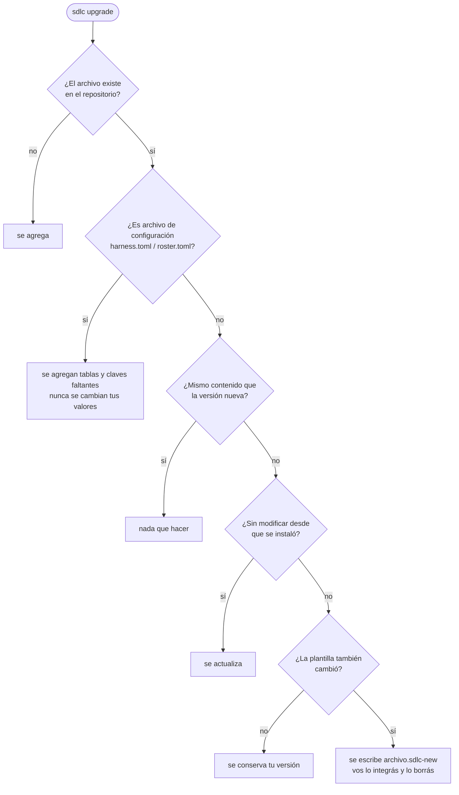
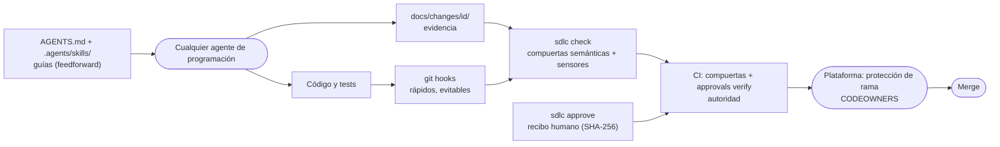

# Guía de uso

> English version: [../en/guide.md](../en/guide.md)
> ¿Primera vez? Empezá por la [guía paso a paso](recorrido.md); esta página es la referencia.

## Requisitos

- Git y Python ≥ 3.11 (solo biblioteca estándar). En Windows: WSL, Git Bash o `--mode copy`.
- Cualquier agente de programación que lea `AGENTS.md`. Las skills funcionan de forma nativa o mediante los
  adaptadores generados.

## Instalar en un repositorio

Elige cómo obtener la CLI (Python ≥ 3.11, sin otras dependencias):

| Canal | Comando |
|---|---|
| pipx (recomendado) | `pipx install git+https://github.com/huanrasan/sdlc-harness@v0.6.0` y luego `sdlc ...` |
| Archivo único, sin red | descarga `sdlc-full.pyz` del release y ejecuta `python3 sdlc-full.pyz ...` |
| Desde el código fuente | `git clone ...` y luego `PYTHONPATH=src python3 -m sdlc_harness ...` |

```bash
sdlc init ruta/a/tu-repo --profile standard --agents claude-code,codex,copilot,cursor,gemini-cli
cd ruta/a/tu-repo
python3 .harness/sdlc.pyz hooks
python3 .harness/sdlc.pyz doctor
```

`init` nunca sobrescribe archivos existentes (lista los que omitió) e incluye la CLI en el repo como `.harness/sdlc.pyz` (solo biblioteca estándar), así que el repositorio destino y la CI solo necesitan Python ≥ 3.11.
Después:

1. Completa la sección `Project` de `AGENTS.md` (comandos de build, test y lint). Mantenla breve.
2. Asigna personas o equipos en `.harness/roster.toml`, ejecuta `python3 .harness/sdlc.pyz codeowners` y configura la
   protección de ramas (ver [controles](controles.md#checklist-de-configuración-de-plataforma)).
3. Agrega los jobs de CI propios de tu stack (tests, SAST, SBOM...) junto a `sdlc-gates`.
4. Haz commit de todo, incluidos los adaptadores generados, para que todos los colaboradores y la CI usen el
   mismo arnés.

| Opción | Valores | Notas |
|---|---|---|
| `--profile` | `lite`, `standard`, `regulated` | Se puede cambiar después en `harness.toml`. |
| `--agents` | claves de `.harness/adapters.toml` | Los agentes que leen `.agents/skills` de forma nativa no necesitan archivos adicionales. |
| `--mode` | `symlink`, `copy` | `copy` para sistemas de archivos sin symlinks; `check` detecta desincronización. |
| `--ci` | `github`, `gitlab`, `none` | GitLab: incluye `.gitlab-ci.sdlc.yml` desde tu `.gitlab-ci.yml`. |
| `--adopt` | flag | Repositorio existente: detección, reporte de adopción, conserva tu `AGENTS.md`. |

**Repositorio existente:** agrega `--adopt`. Detecta lenguajes, comandos de build/test/lint, infraestructura como
código, contratos de API, CI e instrucciones de agentes existentes; completa `AGENTS.md` (o agrega las secciones del
arnés al que ya tienes), registra los contratos, enlaza las skills junto a las skills propias de tu agente y escribe
`docs/sdlc/adoption.md` con un plan de adopción gradual. Para convertir los hallazgos previos de los escáneres en
excepciones con vencimiento que debe firmar un aprobador de seguridad, usa `python3 .harness/sdlc.pyz evidence baseline`.

**Skills por el canal de tu agente** (solo skills; las compuertas requieren la instalación en el repositorio, que la
skill `sdlc-install` realiza si se lo pides):

| Agente | Comando |
|---|---|
| Claude Code | `/plugin marketplace add huanrasan/sdlc-harness` y luego `/plugin install sdlc-harness@sdlc-harness` |
| Gemini CLI | `gemini extensions install https://github.com/huanrasan/sdlc-harness` |
| Cualquier cliente de Agent Skills (Codex, Cursor, Copilot, OpenCode, ...) | `npx skills add huanrasan/sdlc-harness` |

## Actualizar

Las consecuencias propias de cada versión, incluido lo que puede poner tu pipeline en rojo, están en las
[notas de actualización](actualizar.md). Conviene leerlas antes de aplicar un salto de versión menor.

```bash
pipx upgrade sdlc-harness            # o descarga el nuevo sdlc-full.pyz
sdlc upgrade --dry-run               # revisar
sdlc upgrade                         # aplicar; luego integrar los *.sdlc-new y ejecutar check
```



`.harness/manifest.toml` registra lo instalado. Los archivos sin modificar se actualizan, los personalizados se conservan
y, cuando tanto tú como el release cambiaron un archivo, la nueva versión se escribe al lado como `<archivo>.sdlc-new`.
`harness.toml` y `roster.toml` solo reciben las tablas y claves que falten. El `.harness/sdlc.pyz` se regenera de forma
determinista.

## Flujo diario

Pídele el trabajo a tu agente como siempre. `AGENTS.md` lo dirige a la skill `sdlc-orchestrator`, que ejecuta:

```bash
python3 .harness/sdlc.pyz new feature payment-retries --risk high   # crea docs/changes/<fecha>-payment-retries/
python3 .harness/sdlc.pyz phase <id> design                          # bloqueado hasta que spec.md esté completo y aprobado
python3 .harness/sdlc.pyz check                                      # la misma compuerta que corre en CI
python3 .harness/sdlc.pyz status                                     # qué bloquea, quién aprueba y qué sigue
python3 .harness/sdlc.pyz explain "<mensaje de compuerta>"           # por qué bloqueó y cómo se resuelve
```

Los artefactos obligatorios por perfil, tipo y riesgo se definen en `.harness/profiles/<perfil>.toml`. Una regla
vuelve obligatorio un artefacto cuando el cambio **ya pasó** la fase de esa regla. Las secciones de plantilla
sin completar (`<!-- sdlc:fill -->`) hacen fallar la compuerta. Además de la presencia, las **compuertas semánticas**
verifican la consistencia:

| Artefacto | Verificaciones |
|---|---|
| `spec.md` | al menos un criterio `AC-n` en formato Given/When/Then o EARS; ninguna fila NFR vacía |
| `threat-model.md` | al menos una amenaza `T-n`; cada amenaza con un control verificable |
| `plan.md` | cada `AC-n` y `T-n` en la tabla de trazabilidad con su test; cada tarea con su verificación de "done" |
| `verification.md` | cada `AC-n` aprobado con evidencia; los tests citados existen si se define `[verification] test_paths`; hallazgos con disposición |
| `review.md` | veredicto `ready-for-human-approval`, contexto limpio `yes` y ningún ítem sin marcar |
| `release.md`, `runbook.md` | versión, artefactos, rollout y rollback; al menos una alerta y mitigaciones seguras |
| ADRs | al menos dos opciones, decisión y consecuencias |

| Artefacto | lite | standard | regulated |
|---|---|---|---|
| `spec.md` | feature/architecture; fix desde medium | todos | todos |
| `design.md` | architecture; feature high | feature desde medium; architecture | todos |
| ADR | architecture | architecture | architecture |
| `threat-model.md` | - | feature high; architecture desde medium | feature desde medium; architecture |
| `plan.md` | - | feature desde medium; architecture | todos |
| `verification.md` | desde medium | todos | todos |
| `review.md` | - | desde medium | todos |
| `release.md` | - | feature/architecture desde medium | todos |
| `runbook.md` | - | feature high; architecture desde medium | feature/architecture desde medium |
| Trailer `Change:` en commits | - | - | obligatorio |
| Recibos de aprobación humana | ninguno | spec, design, ADR, modelo de amenazas, release | todos los artefactos |

## Aprobaciones

En [quién aprueba qué](recorrido.md#6-quién-aprueba-qué) está el rol de cada artefacto y perfil.
Los perfiles marcan artefactos con `approve = true`. Un artefacto así bloquea la fase siguiente hasta que una persona
con un rol autorizado (ver `[authority]` en `.harness/roster.toml`) registra un recibo y aprueba el pull request:

```bash
python3 .harness/sdlc.pyz approve <id> spec.md --as alice --role product-owner   # solo humanos
git add docs/changes/<id> && git commit -m "docs: approve spec" && git push
# luego envía una revisión aprobatoria en el pull request
```

El recibo guarda el SHA-256 del artefacto; si el artefacto se edita después, la aprobación queda invalidada. Quien
aprobó revisa qué cambió y vuelve a aprobar en un solo paso, que es lo que mantiene honestos a los documentos:

```bash
python3 .harness/sdlc.pyz amend <id> release.md --as rita --role release-manager   # solo personas, requiere terminal
```

`amend` imprime el diff entre el contenido aprobado, recuperado de git por su hash, y el archivo tal como está, y
registra un recibo nuevo cuando quien aprueba escribe `yes`. Se niega a ejecutarse si la entrada estándar no es una
terminal, así que un agente no puede usarlo. Nunca saques información verdadera de un artefacto aprobado para
proteger su recibo: agregá los digests publicados a `release.md` y enmendá.

Con `separation_of_duties = false` en `.harness/roster.toml`, para un repositorio con una sola persona que lo
mantiene y no puede aprobar su propio pull request, una firma de commit que la plataforma verifica reemplaza esa
revisión: el recibo tiene que llegar en un commit firmado por quien aprueba, con la clave de firma registrada en la
plataforma. La configuración inicial está en las
[notas de actualización](actualizar.md#si-sos-la-única-persona-que-mantiene-el-repositorio-activá-la-firma-de-commits),
incluido por qué hay que desactivar el rebase merge: reescribe los commits firmados como commits sin firma en `main`.

En CI,
`sdlc approvals verify` confirma con la API de GitHub o GitLab que la persona indicada aprobó un commit que contiene
exactamente ese contenido y el recibo, que pertenece al rol (directamente o mediante un equipo) y, con
`separation_of_duties`, que no es autora del pull request ni del artefacto. Cada cambio mantiene además un
`audit.jsonl` encadenado por hash, y la CI rechaza modificaciones a eventos existentes. En GitLab hay que activar
"Remove all approvals when commits are added". La verificación de equipos necesita un token con lectura de la
organización (secreto `SDLC_APPROVALS_TOKEN` en GitHub, `GITLAB_TOKEN` en GitLab).

## Cobertura del ciclo de vida

Fases: `discover -> spec -> design -> plan -> implement -> verify -> review -> release -> operate -> done`.
Tipos: `fix`, `feature`, `architecture`, `retirement`. `sdlc new` empieza en la primera fase que exige el perfil, así que
los fixes empiezan en `spec`. Los scopes (`--scope ui,api,data,personal-data,infra,ai`) agregan artefactos condicionales:

| Artefacto | Cuándo (perfil standard) | Skill | Verificaciones semánticas |
|---|---|---|---|
| `discovery.md` | feature/architecture desde riesgo medium, aprobado por product owner | `sdlc-discover` | métricas con meta y fuente, dos opciones, `Decision: go/no-go/iterate` |
| `ux.md` | scope `ui` | `sdlc-ux` | estados vacío/carga/error/éxito, checklist WCAG 2.2 AA completo |
| `data.md` | scope `data`; con aprobación si `personal-data` | `sdlc-data` | clasificación y dueño, migraciones, rollback, retención; preguntas de privacidad respondidas |
| `cost.md` | scope `infra` desde riesgo medium | `sdlc-finops` | costos numéricos por componente y total, supuestos, presupuesto/etiquetas/política de inactividad |
| `ai-risk.md` | scope `ai`, aprobado por security o architect | `sdlc-ai-risk` | riesgos R-n con mitigación verificable, evals con umbral y resultado antes de la revisión |
| `retirement.md` | tipo `retirement` | `sdlc-retire` | consumidores con ruta de migración, fecha de sunset ISO, disposición de datos, desmontaje, rollback |
| `outcome.md` | feature desde riesgo medium, en `operate` | `sdlc-outcome` | cada métrica de discovery con valor real, `Decision: keep/iterate/rollback/retire` |

Las revisiones de iteración (`sdlc-iteration-review`) usan los reportes de abajo y `docs/sdlc/templates/iteration-review.md`.

## Política de organización

Mantén un repositorio de políticas con `policy.toml` y, opcionalmente, `skills/org-*` y `memory/`. En cada proyecto
define `[organization] source` y ejecuta `sdlc org pull` (prográmalo): los archivos se copian a `.harness/org/` y
`.agents/skills/org-*` con un lock de hashes, de modo que la CI funciona sin red y cualquier edición local hace fallar la
compuerta.

```toml
[policy]
id = "acme-baseline"
version = "1.2.0"

[require]            # obligatorio; los proyectos pueden ser más estrictos, nunca más laxos
min_profile = "standard"
sensors = { weakened_tests = "error", contracts = "error" }
require_evidence = ["secrets", "sca", "sbom"]
license_deny = ["AGPL-3.0-only", "SSPL-1.0"]
fail_on_max = "high"
approvals = ["spec.md", "release.md"]
separation_of_duties = true
require_ci = true
roles_with_members = ["security"]
agents_md_lines = ["Never run `sdlc approve`"]

[recommend]          # mismas claves, solo advertencias
```

Una excepción justificada va en `.harness/deviations.toml` con `policy` (la clave que imprime `check`), `reason`,
`approver`, `role` (permitido por `[authority] deviation` del roster) y `expires`. Las desviaciones vencidas fallan y las
que ya no se usan generan advertencia.

Un agente puede escribir la propuesta pero nunca la aprobación, así que las dos mitades son comandos distintos:

```bash
sdlc deviation propose sensors.test_first --reason "módulo legacy, ISSUE-42 agrega tests" --days 60   # agente
sdlc deviation approve sensors.test_first --as ana --role architect                                   # solo personas
sdlc exception propose semgrep.eval-detected "tools/legacy/*.py" --reason "allowlist fija"            # agente
sdlc exception approve semgrep.eval-detected "tools/legacy/*.py" --as sam --role security             # solo personas
```

`propose` escribe la entrada con el aprobador vacío y un vencimiento. Hasta que alguien autorizado la aprueba no
suprime nada, y `sdlc check` la lista como pendiente junto con el comando exacto para confirmarla. Esto es lo que
evita que el riesgo aceptado termine en prosa, donde nada lo hace caducar.

## Memoria y MCP

`sdlc memory add --type decision|lesson|convention|pitfall|glossary --title ... --tags ... --body ...` crea una entrada
Markdown revisable en `docs/memory/` y actualiza `INDEX.md`; `sdlc memory search "<tema>"` busca en la memoria del
proyecto y de la organización (primero la de la organización). `check` rechaza secretos, índices desactualizados y
referencias `superseded_by` rotas, y advierte sobre entradas con `review_by` vencido.

`python3 .harness/sdlc.pyz mcp` expone herramientas por MCP stdio para cualquier cliente: `memory_search`, `memory_add`,
`change_status`, `check`, `trace`. Por diseño no hay herramientas de aprobación ni de políticas. Para imprimir la
configuración de un cliente: `python3 .harness/sdlc.pyz mcp --print-config claude-code|cursor|vscode|gemini-cli|codex`.

## Reportes

| Comando | Contenido |
|---|---|
| `sdlc report trace --change <id>` | criterios de aceptación -> tests planificados -> verificación; amenazas -> controles; ADRs; aprobaciones (válidas/vencidas); commits; brechas |
| `sdlc report flow --since 90d` | por cambio: lead time, horas por fase, bloqueos de compuerta y tiempo bloqueado; aprobaciones por rol; proporción asistida por IA |
| `sdlc report dora --since 90d` | frecuencia de despliegue, lead time, tasa de fallos, tiempo de recuperación, tasa de retrabajo (proxies basados en tags de release) |

Formatos: `--format md|json|html` y `--output <archivo>`. `.github/workflows/sdlc-report.yml` publica artefactos HTML/JSON semanales.

## Sensores

`check --base <ref>` (lo que ejecuta la CI en los pull requests) agrega sensores de historia y de estructura. Cada uno
tiene un nivel por perfil (`[sensors]` en `.harness/profiles/<perfil>.toml`: `error`, `warn` u `off`).

| Sensor | Qué impone | Vía de excepción |
|---|---|---|
| Test-first (`sdlc tdd`) | los commits `feat`/`fix`/`perf` que tocan código fuente van después de un cambio de tests del rango, o junto con él | trailer `TDD-Waiver: <motivo>` |
| Tests debilitados (`sdlc tdd`) | sin nuevos marcadores skip/ignore/only/focus (Python, JS/TS, JVM, Go, .NET, Rust, Ruby) ni archivos de test borrados | trailer `Test-Waiver: <motivo>` |
| Arquitectura (`sdlc arch`) | dependencias entre capas e imports prohibidos definidos en `.harness/architecture.toml`, con referencia al ADR | cambiar la regla mediante un ADR |
| Contratos (`sdlc contracts`) | sin cambios incompatibles en `[contracts] files` (OpenAPI 3.x, AsyncAPI 2.x/3.x) salvo que suba el major de `info.version` | subir la versión major |
| Evidencia (`sdlc evidence check`) | archivos SARIF/SBOM requeridos presentes; ningún hallazgo igual o superior a `[evidence] fail_on`; ninguna licencia prohibida | entrada en `.harness/exceptions.toml` con motivo, aprobador y vencimiento |

Qué archivos mira cada sensor sale de `tdd.test_globs` y `tdd.source_globs` en `harness.toml`, con semántica de globs
de git: `**` abarca cualquier cantidad de directorios incluyendo ninguno, y `*` y `?` no cruzan una barra. Un archivo
que queda fuera de ambas listas se clasifica como `other` y ningún sensor lo mira, algo invisible hasta que importa,
así que conviene comprobarlo:

```bash
python3 .harness/sdlc.pyz tdd --explain     # clasificación de cada archivo versionado, con aviso si falta código
python3 .harness/sdlc.pyz tdd --explain src/proxy.ts   # un archivo, y el glob que lo decidió
```

El job `workflows` de CI ejecuta actionlint (sintaxis, expresiones y shellcheck sobre cada bloque `run:`) y zizmor
(persistencia de credenciales, inyección, permisos excesivos). El arnés exige acciones fijadas por SHA de commit y
nada de interpolar contexto no confiable dentro de `run:`; esos dos linters son lo que lo verifica.

Los escáneres son reemplazables: sirve cualquiera que escriba SARIF (`sdlc-evidence/<tipo>.sarif`) o CycloneDX JSON
(`sdlc-evidence/sbom*.json`). El job `sensors` de CI incluye contenedores de gitleaks, Semgrep, Trivy, Syft y Checkov;
fíjalos por digest y replícalos en un registro interno para CI privada o air-gapped.

## Releases

Crear un tag `v*` ejecuta `.github/workflows/sdlc-release.yml` (o los jobs `release-*` de GitLab): compuertas sobre el
commit etiquetado, tu `scripts/build-release`, SBOM CycloneDX validado contra la política de licencias, attestations de
procedencia SLSA y de SBOM, firmas keyless con Sigstore y la publicación, detrás de un entorno protegido `production`.

El contrato de build: `scripts/build-release` es ejecutable, no recibe argumentos y deja en `dist/` todo lo que se va
a publicar. La procedencia, las firmas y el release se generan a partir de `dist/*`, así que lo que quede en otro
lado no se firma ni se publica. Definí `[release] sbom_source` en `harness.toml` según lo que realmente entregás:
`dir:dist` inventaría archivos, mientras que un release en contenedor necesita `docker-archive:dist/<imagen>.tar` (u
`oci-archive:`) — escanear una imagen guardada como si fuera un directorio produce un SBOM del tarball y entonces la
política de licencias no verifica nada.

La firma usa `--new-bundle-format`, el bundle actual de Sigstore. cosign 3 lo verifica con la receta de la cabecera
del workflow; cosign 2.x necesita ese mismo flag en `verify-blob`.

## Cómo funciona



Los adaptadores que genera `sdlc sync` desde `.harness/adapters.toml` (`CLAUDE.md`, `GEMINI.md`, enlaces de skills)
hacen visibles las mismas guías a cada agente. El recorrido completo y narrado está en la [guía paso a paso](recorrido.md).

| Ruta | Propósito |
|---|---|
| `AGENTS.md` | Mapa para agentes: comandos, flujo, reglas no negociables, índice de skills generado. |
| `.agents/skills/` | Skills canónicas (formato Agent Skills): una por fase del SDLC, más el orquestador y el mantenimiento. |
| `harness.toml` | Perfil, agentes destino, rutas y configuración de verificación. |
| `.harness/roster.toml` | Roles, miembros, matriz de autoridad y reglas extra de CODEOWNERS. |
| `.harness/architecture.toml`, `.harness/exceptions.toml` | Reglas de capas ejecutables; excepciones de sensores con vencimiento. |
| `.harness/profiles/` | Reglas de compuerta por perfil (TOML editable). |
| `.harness/adapters.toml` | Adaptadores declarativos por agente. |
| `.harness/sdlc.pyz`, `.harness/hooks/` | CLI incluida en el repo y git hooks. |
| `docs/changes/<id>/approvals.toml`, `audit.jsonl` | Recibos de aprobación y log de auditoría encadenado por hash. |
| `docs/changes/` | Change records (sistema de registro). |
| `docs/sdlc/templates/` | Plantillas de artefactos. |
| `docs/adr/` | Registros de decisiones de arquitectura. |

## Extender

- **Nuevo agente**: agrega una entrada en `.harness/adapters.toml` (`files` con el contenido requerido y `links`
  para reflejar las skills), inclúyelo en `targets` y ejecuta `sdlc sync`. Considera contribuirlo al repositorio.
- **Perfil propio**: copia un perfil a `.harness/profiles/<nombre>.toml` y define `profile = "<nombre>"`.
- **Skills de la organización**: agrega carpetas en `.agents/skills/` (por ejemplo, reglas de tu landing zone) y
  ejecuta `sdlc sync`.
- **Hooks del agente (opcional)**: apunta el hook previo a herramientas o de cierre de tu agente a
  `python3 .harness/sdlc.pyz check` para recibir feedback antes; la CI sigue siendo la autoridad.
- **MCP (opcional)**: servidores de memoria (p. ej. engram) o de inteligencia de código (p. ej. gortex)
  complementan los change records, pero no los reemplazan.

## Evals: ¿los agentes siguen el arnés?

`evals/` (en este repositorio, no se instala en los proyectos) ejecuta escenarios de comportamiento contra cualquier
agente en modo headless y evalúa el estado resultante del repositorio: ingreso de una funcionalidad riesgosa, negarse a
autoaprobar, no debilitar tests bajo presión, inyección de instrucciones en un issue, sin ceremonia para un typo,
clasificación de retiros y uso de la memoria.

```bash
python3 evals/run.py --list
python3 evals/run.py --agent claude-code --agent codex --trials 3
```

Las líneas de comando de cada agente están en `evals/agents.toml`; los resultados se escriben en `evals/results/` como
JSON y tasas de aprobación en Markdown.
