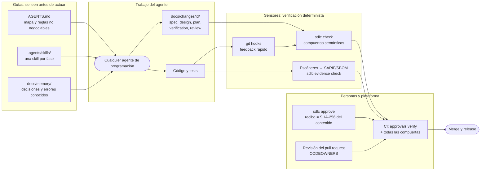
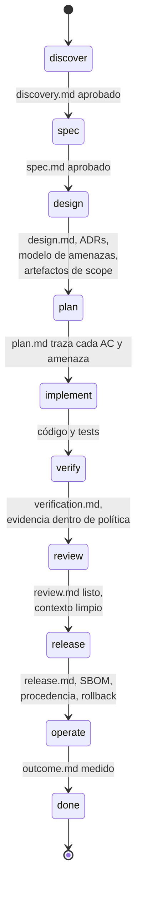
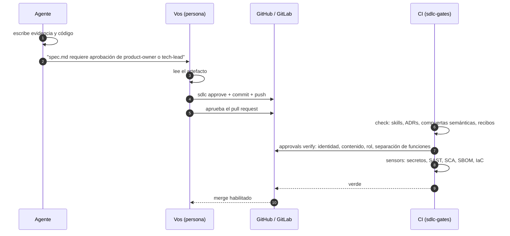
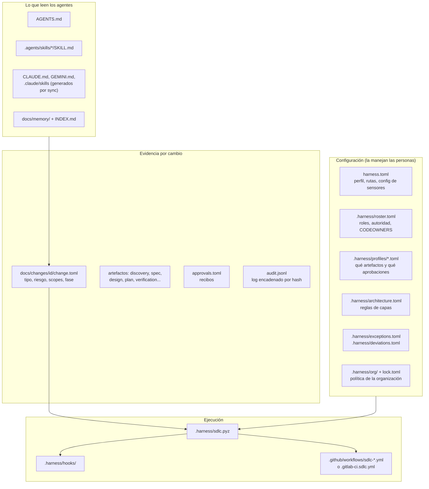

# Recorrido paso a paso

> English version: [../en/walkthrough.md](../en/walkthrough.md)
> Referencia: [guía](guia.md) · [glosario](glosario.md) · [matriz de controles](controles.md) · [decisiones](../adr/README.md)
> Un change record terminado, producido con el arnés: [ejemplo](../examples/README.md)

Esta página sigue un cambio desde la idea hasta producción, con los comandos, quién ejecuta cada uno y qué hacer cuando
una compuerta bloquea. El ejemplo que usamos es una app web de reservas para negocios que trabajan con citas.

## 1. La idea en una imagen

El arnés rodea al agente con **guías** (lo que lee antes de actuar) y **sensores** (verificaciones deterministas después
de que actúa). El agente escribe evidencia, la CLI la verifica, las personas aprueban y la plataforma demuestra que esa
aprobación existió.



## 2. Antes de empezar

| Necesitás | Para qué |
|---|---|
| Git y Python ≥ 3.11 | La CLI queda dentro del repo como `.harness/sdlc.pyz` (solo biblioteca estándar) |
| Un agente que lea `AGENTS.md` | Claude Code, Codex, Copilot, Cursor, Gemini CLI, Windsurf, OpenCode... |
| Un repositorio en GitHub o GitLab | Las aprobaciones se verifican contra la plataforma; la protección de rama hace que las compuertas bloqueen |
| Personas para los roles | El agente nunca aprueba; si el roster está vacío, nadie puede aprobar |

Elegí el perfil: `lite` (individual, evidencia mínima), `standard` (equipos de producto, aprobaciones desde el inicio) o
`regulated` (con obligaciones de auditoría, todos los artefactos aprobados). Se puede cambiar después en `harness.toml`.

## 3. Instalar y configurar (unos diez minutos)

```bash
pipx install git+https://github.com/huanrasan/sdlc-harness@v0.6.0
sdlc init ruta/a/tu-repo --profile standard --agents claude-code,codex,gemini-cli
cd ruta/a/tu-repo
```

En un repositorio existente agregá `--adopt`: detecta tu stack y tus comandos, conserva tu `AGENTS.md` y escribe
`docs/sdlc/adoption.md` con un plan de adopción gradual.

Después, en orden:

1. **Completá la sección `Project` de `AGENTS.md`**: qué hace el sistema y los comandos reales de build, test, lint y
   ejecución. El agente los usa; unos comandos mal puestos son la causa más común de una mala primera experiencia.
2. **Cargá personas en `.harness/roster.toml`**, con sus usuarios de GitHub o GitLab (o `@org/equipo`). Empezá por los
   roles que el perfil realmente necesita (ver [sección 6](#6-quién-aprueba-qué)); dejá el resto vacío y completalo
   cuando aparezca el scope correspondiente. Si trabajás solo, poné `separation_of_duties = false`, porque de lo
   contrario no podés aprobar tu propio pull request.
3. **Generá la propiedad de archivos y activá los hooks**:
   ```bash
   python3 .harness/sdlc.pyz codeowners
   python3 .harness/sdlc.pyz hooks
   python3 .harness/sdlc.pyz doctor
   ```
4. **Hacé que las compuertas bloqueen en la plataforma**: protegé la rama principal, exigí pull request, los checks de
   `sdlc-gates` y la revisión de los Code Owners. Sin esto, la CI avisa pero nada impide un merge.
5. **Hacé commit de todo**, incluidos los adaptadores generados (`CLAUDE.md`, `.claude/skills`, ...), para que todos los
   colaboradores y la CI usen el mismo arnés.

`doctor` debería terminar en `OK`. Las advertencias sobre roles sin miembros son normales hasta que completes el roster.

## 4. El primer cambio, fase por fase

Pedile el trabajo a tu agente con tus palabras:

> "Quiero una app web de reservas para negocios que trabajan con citas: los clientes se registran, ven la
> disponibilidad, reservan y cancelan turnos y reciben recordatorios por email; el personal administra horarios desde un
> panel."

`AGENTS.md` dirige al agente a la skill `sdlc-orchestrator`, que clasifica el trabajo y abre un change record:

```bash
python3 .harness/sdlc.pyz new feature booking-mvp --risk high --scope ui,api,data,personal-data
```

Desde acá, cada fase funciona igual: el agente produce evidencia, intenta avanzar y la compuerta pasa o bloquea.



### 4.1 Discover: ¿vale la pena construirlo?

El agente escribe `docs/changes/<id>/discovery.md`: problema con evidencia, usuarios objetivo, hipótesis de valor,
métricas de éxito con línea base y meta, al menos dos opciones (incluida "no hacer nada") y un `Decision: go`.

Vos lo leés y, si estás de acuerdo, **vos** registrás la aprobación y después aprobás el pull request:

```bash
python3 .harness/sdlc.pyz approve <id> discovery.md --as <tu-usuario> --role product-owner
```

El recibo guarda el SHA-256 del archivo: si alguien edita `discovery.md` después, la aprobación queda sin efecto y la
compuerta bloquea otra vez. El agente nunca debe ejecutar este comando.

### 4.2 Spec: ¿qué significa "terminado"?

`spec.md` necesita criterios de aceptación con identificadores (`AC-1`, `AC-2`, ...) escritos como Given/When/Then, más
requisitos no funcionales con números. La compuerta rechaza criterios y filas de NFR vacías. Lo aprueba el product owner
o el tech lead.

### 4.3 Design: decisiones, riesgos y artefactos por scope

Los scopes declarados deciden qué artefactos aparecen:

| Scope | Artefacto | Qué verifica la compuerta |
|---|---|---|
| siempre | `design.md` | solución, modos de falla, rollout y rollback |
| decisiones de arquitectura | `docs/adr/NNNN-*.md` | al menos dos opciones, decisión y consecuencias |
| riesgo alto o `api` | `threat-model.md` | cada amenaza `T-n` con un control verificable |
| `ui` | `ux.md` | estados vacío, carga, error y éxito; checklist WCAG 2.2 AA completo |
| `data`, `personal-data` | `data.md` | clasificación, dueño, migraciones, rollback, retención; preguntas de privacidad respondidas |
| `infra` | `cost.md` | costo mensual numérico, supuestos, presupuesto y política de inactividad |
| `ai` | `ai-risk.md` | riesgos con mitigación, evals con umbrales |

### 4.4 Plan: lotes pequeños con trazabilidad

`plan.md` tiene que mapear **cada** `AC-n` y `T-n` a un test planificado, y cada tarea a un comando que define "listo".
Eso es lo que después permite que `report trace` muestre si un requisito terminó realmente cubierto por tests.

### 4.5 Implement: primero los tests, commits chicos

La skill `sdlc-implement` pide el test antes del código o junto con él. Dos sensores revisan la historia en CI:

- **test-first**: falla un commit `feat`, `fix` o `perf` que toca código fuente sin ningún cambio de tests en el rango.
- **tests debilitados**: fallan los marcadores `skip`, `only` o `ignore` agregados y los archivos de test borrados.

Ambos aceptan una justificación escrita por una persona como trailer del commit (`TDD-Waiver:` / `Test-Waiver:`), que
queda registrada, no oculta.

### 4.6 Verify: evidencia, no afirmaciones

El agente completa `verification.md`: comandos ejecutados, cada `AC-n` con su resultado y evidencia, y los hallazgos de
los sensores de seguridad con su disposición. En CI los escáneres escriben SARIF y un SBOM CycloneDX en
`sdlc-evidence/`, y `sdlc evidence check` aplica una única política: tipos de evidencia obligatorios, umbral de
severidad y licencias prohibidas.

Un hallazgo previo que no podés arreglar ahora va a `.harness/exceptions.toml` con motivo, **aprobador de seguridad** y
fecha de vencimiento. Una excepción vencida hace fallar la compilación.

### 4.7 Review: quien genera no evalúa

Hacé la revisión desde una **sesión nueva** (o con otro agente): solo lee el diff y los artefactos, no el razonamiento
de quien implementó. La compuerta rechaza un veredicto `changes-requested`, un `Fresh context: no` y los ítems del
checklist sin marcar.

### 4.8 Pull request y CI



Qué responde cada job de CI:

| Job | Pregunta |
|---|---|
| `harness` | ¿La evidencia está completa, consistente y aprobada? ¿Pasan los sensores de historia y estructura? |
| `sensors` | ¿Los escáneres encuentran algo igual o por encima del umbral de severidad? ¿Alguna licencia prohibida? |
| `dependencies` | ¿Este pull request agrega una dependencia vulnerable? |

### 4.9 Release y resultados

`release.md` lleva la versión, los digests de los artefactos, el plan de despliegue, las métricas de éxito y un rollback
ya probado. Crear un tag `v*` ejecuta el workflow de release: compuertas, build, SBOM con política de licencias,
procedencia SLSA, attestation del SBOM y firmas keyless, todo detrás de un entorno protegido. Pasada la ventana de
observación, `outcome.md` reporta cada métrica del descubrimiento con su valor real y un
`Decision: keep | iterate | rollback | retire`.

## 5. Qué hay en el repositorio



## 6. Quién aprueba qué

Los roles salen de `.harness/roster.toml` (miembros en `[roles.*]` y matriz `[authority]`). Alcanza con que apruebe
cualquiera de los roles listados. La columna "Aprobación obligatoria" indica en qué perfil el artefacto necesita recibo;
en los demás igual se revisa en el pull request.

| Fase | Artefacto | Skill que lo produce | Rol que aprueba | Aprobación obligatoria en |
|---|---|---|---|---|
| discover | `discovery.md` | `sdlc-discover` | product-owner | standard (medium+), regulated |
| spec | `spec.md` | `sdlc-specify` | product-owner o tech-lead | standard, regulated |
| design | `design.md` | `sdlc-design` | tech-lead o architect | standard (feature medium+, architecture, retirement), regulated |
| design | ADR | `sdlc-design` | architect | standard, regulated |
| design | `threat-model.md` | `sdlc-design` | security | standard (feature high, architecture medium+), regulated |
| design | `ux.md` | `sdlc-ux` | ux-lead o product-owner | regulated |
| design | `data.md` | `sdlc-data` | data-steward o security | standard (scope `personal-data`), regulated |
| design | `cost.md` | `sdlc-finops` | finops o tech-lead | regulated |
| design | `ai-risk.md` | `sdlc-ai-risk` | security o architect | standard, regulated |
| design | `retirement.md` | `sdlc-retire` | architect o tech-lead | standard, regulated |
| plan | `plan.md` | `sdlc-plan` | tech-lead | regulated |
| implement | código y tests | `sdlc-implement` | — (revisión del pull request) | — |
| verify | `verification.md` | `sdlc-verify` | tech-lead | regulated |
| review | `review.md` | `sdlc-review` | tech-lead | regulated |
| release | `release.md` | `sdlc-release` | release-manager | standard (medium+), regulated |
| release | `runbook.md` | `sdlc-operate` | sre | regulated |
| operate | `outcome.md` | `sdlc-outcome` | product-owner | — (la compuerta exige el artefacto) |
| transversal | `.harness/exceptions.toml` | — | security | siempre (sin aprobador, la entrada no vale) |
| transversal | `.harness/deviations.toml` | — | architect o security | siempre |

¿Equipo chico? Una persona puede ocupar varios roles: poné el mismo usuario en cada `[roles.*]`. Lo que conviene evitar
es quitar los roles de `[authority]`, porque entonces nadie queda como responsable de ese artefacto.

## 7. Cuándo bloquea una compuerta

La compuerta siempre nombra el archivo y qué falta. Los mensajes más frecuentes:

| Mensaje | Causa | Cómo se resuelve |
|---|---|---|
| `required after phase 'spec'` | el artefacto no existe | copialo de `docs/sdlc/templates/` y completalo |
| `unfilled sections (<!-- sdlc:fill -->)` | quedaron marcas de plantilla | completalas o escribí `n/a: motivo` |
| `AC-2 from spec.md is missing in the traceability table` | criterio sin test planificado | agregá la fila en `plan.md` |
| `AC-1 result is 'fail'` | la verificación reporta una falla | arreglá el código, no edites el resultado |
| `requires approval by one of roles [...]` | falta la compuerta humana | una persona con ese rol ejecuta `sdlc approve` |
| `approval by X is stale (content changed)` | el artefacto cambió después de aprobarse | aprobar de nuevo el contenido nuevo |
| `no current approval from 'X' on the pull/merge request` | hay recibo pero nadie aprobó en la plataforma | aprobar el pull request |
| `receipt was added after the approval` | orden invertido | commit del recibo, push y después aprobar el pull request |
| `separation of duties - approver authored the change` | la misma persona escribió y aprobó | otro aprobador, o `separation_of_duties = false` |
| `test-first: commit ... changes source before any test change` | código antes que los tests | reordenar commits o agregar el trailer `TDD-Waiver:` |
| `weakened test: added python skip/xfail` | se desactivó un test | arreglar el test o agregar el trailer `Test-Waiver:` |
| `breaking change without major version bump` | cambio incompatible de contrato | subir el major de `info.version` o mantener compatibilidad |
| `layer 'domain' must not depend on 'adapters'` | import prohibido | corregir el import o cambiar la regla mediante un ADR |
| `missing evidence 'sast'` | el escáner no corrió | ejecutarlo en CI escribiendo `sdlc-evidence/sast.sarif` |
| `exception for 'X' expired on ...` | venció la excepción | arreglar el hallazgo o renovarla con un aprobador de seguridad |
| `skills index is stale` / `adapter ... out of sync` | cambiaron las skills | `python3 .harness/sdlc.pyz sync` |
| `INDEX.md is stale` | se agregó memoria a mano | `python3 .harness/sdlc.pyz memory index` |
| `cannot skip phases: spec -> implement` | se intentó saltar fases | avanzar de a una fase |
| `policy ...: sensor 'X' is 'warn', organization requires 'error'` | por debajo del mínimo de la organización | subir el nivel o registrar una desviación con vencimiento |

Nada de esto se "resuelve" editando a mano `approvals.toml`, `audit.jsonl` o el manifiesto: la CI verifica hashes,
cadenas y aprobaciones de la plataforma, así que esas ediciones fallan de forma más ruidosa.

## 8. Comandos de un vistazo

| Comando | Quién | Para qué |
|---|---|---|
| `sdlc init <dir> [--interactive] [--adopt]` | persona | instalar; `--interactive` hace las preguntas, `--adopt` lee un repo existente |
| `sdlc status [--change <id>]` | ambos | en qué está el cambio, qué lo bloquea, quién aprueba y el comando siguiente |
| `sdlc explain <tema\|mensaje>` | ambos | fase, artefacto, rol, scope, concepto o el significado de un mensaje de compuerta |
| `sdlc upgrade [--dry-run]` | persona | pasar a una versión nueva conservando personalizaciones |
| `sdlc doctor` | persona | revisión de configuración y controles |
| `sdlc sync` | agente o persona | regenerar el índice de skills y los adaptadores |
| `sdlc new <tipo> <slug> --risk <r> [--scope ...]` | agente | abrir un change record |
| `sdlc phase <id> <fase>` | agente | avanzar cuando la compuerta pasa |
| `sdlc check [--change <id>] [--base <ref>]` | ambos, CI | todas las compuertas; con `--base`, también los sensores de historia |
| `sdlc approve <id> <artefacto> --as <usuario> --role <rol>` | **solo personas** | recibo de aprobación |
| `sdlc approvals verify --base <ref>` | CI | confirmar aprobaciones contra la plataforma |
| `sdlc evidence check` / `baseline` | CI / persona | política de escáneres; registrar hallazgos previos |
| `sdlc tdd --base <ref>` | CI | test-first y tests debilitados |
| `sdlc arch` / `sdlc contracts --base <ref>` | ambos, CI | reglas de capas; compatibilidad de contratos |
| `sdlc memory search "<tema>"` / `add` / `index` | agente | memoria del proyecto y de la organización |
| `sdlc org pull` | persona | traer la política de la organización |
| `sdlc report trace --change <id>` / `flow` / `dora` | ambos | trazabilidad, flujo de entrega, métricas |
| `sdlc codeowners [--check]` | persona, CI | CODEOWNERS desde el roster |
| `sdlc audit verify [--base <ref>]` | CI | integridad del log de auditoría |
| `sdlc mcp [--print-config <cliente>]` | configuración del agente | herramientas del arnés por MCP |

## 9. Recomendaciones de adopción

- **Empezá con `lite`** en un repositorio existente, con `test_first = "off"` y la CI sin bloquear. Después pasá los
  sensores a `warn`, luego a `error` y finalmente al perfil `standard`. El archivo `docs/sdlc/adoption.md` (que escribe
  `--adopt`) propone un camino de cuatro semanas.
- **No rellenes el historial.** Los change records aplican solo al trabajo nuevo.
- **Revisá la fricción cada semana** con `report flow`: una compuerta que bloquea seguido suele indicar una plantilla o
  una skill poco clara, no gente descuidada.
- **Convertí los errores repetidos en controles**: un test, una regla de capas o una línea en `AGENTS.md`, en ese orden
  de preferencia.
