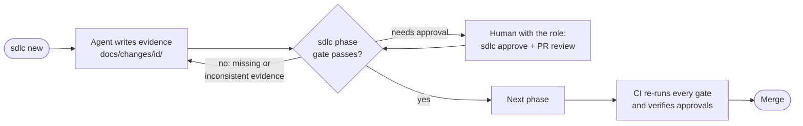

# How work flows in this repository

The SDLC harness turns the development process into evidence a machine can check and humans approve.
Agents read `AGENTS.md` and the skills in `.agents/skills/`; the gates run locally (git hooks), in CI and on the
platform. Full documentation: https://huanrasan.github.io/sdlc-harness/ (step-by-step walkthrough in English and Spanish).

## One change, end to end



Phases: `discover → spec → design → plan → implement → verify → review → release → operate → done`.
`sdlc new` starts at the first phase this repository's profile requires, so small fixes start at `spec`.

## Everyday commands

| Command | Purpose |
|---|---|
| `python3 .harness/sdlc.pyz new <fix\|feature\|architecture\|retirement> <slug> --risk <low\|medium\|high> [--scope ui,api,data,personal-data,infra,ai]` | open a change record |
| `python3 .harness/sdlc.pyz phase <id> <phase>` | advance when the gate passes |
| `python3 .harness/sdlc.pyz status [--change <id>]` | what blocks the change, who must approve, the next command |
| `python3 .harness/sdlc.pyz explain <topic or gate message>` | what a phase, artifact, role or error means |
| `python3 .harness/sdlc.pyz check [--change <id>] [--base origin/main]` | run the gates locally |
| `python3 .harness/sdlc.pyz approve <id> <artifact> --as <user> --role <role>` | **humans only**: approval receipt |
| `python3 .harness/sdlc.pyz memory search "<topic>"` | prior decisions and pitfalls |
| `python3 .harness/sdlc.pyz report trace --change <id>` | requirement → test → verification → approval |
| `python3 .harness/sdlc.pyz doctor` | configuration and controls review |

## Who approves what here

Roles and their members live in `.harness/roster.toml`; which artifacts need a receipt is decided by the profile in
`harness.toml` (`.harness/profiles/<profile>.toml`). Run this to see the current matrix:

```bash
python3 - <<'PY'
import tomllib, pathlib
roster = tomllib.loads(pathlib.Path(".harness/roster.toml").read_text())
profile = tomllib.loads(pathlib.Path("harness.toml").read_text())["harness"]["profile"]
rules = tomllib.loads(pathlib.Path(f".harness/profiles/{profile}.toml").read_text())["rules"]
need = sorted({r["artifact"] for r in rules if r.get("approve")})
for artifact in need:
    roles = roster["authority"].get(artifact, [])
    people = [m for role in roles for m in roster["roles"].get(role, {}).get("members", [])]
    print(f"{artifact:18} roles={', '.join(roles) or '-':35} people={', '.join(people) or 'NOBODY: fill the roster'}")
PY
```

## Rules that protect the process

- Agents never approve, never edit `approvals.toml` or `audit.jsonl`, and never weaken tests or gates.
- Any edit to an approved artifact invalidates its approval; approve the new content again.
- Exceptions to security findings (`.harness/exceptions.toml`) and deviations from organization policy
  (`.harness/deviations.toml`) need a named approver and an expiry date.
- When a gate blocks, fix the evidence or ask the human whose approval is missing; never bypass hooks or CI.
